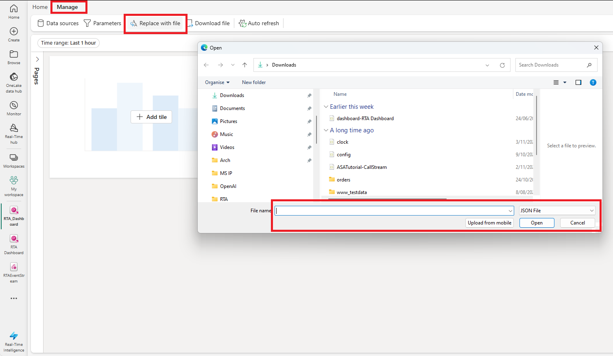
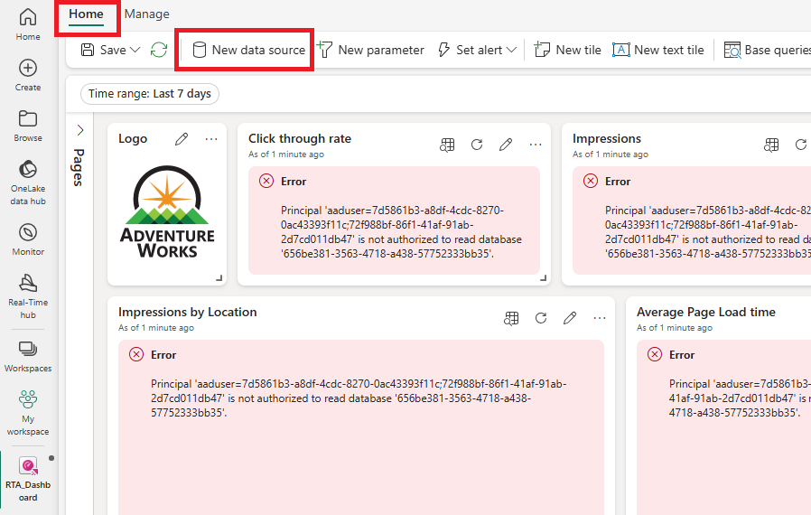
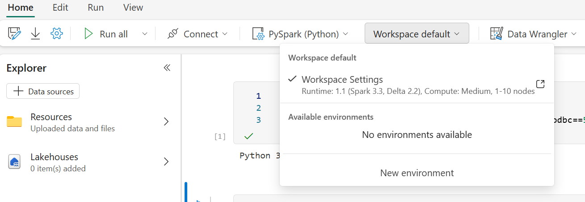
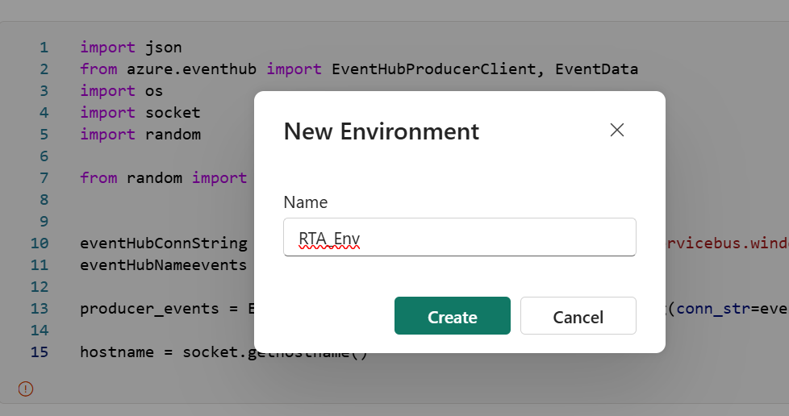
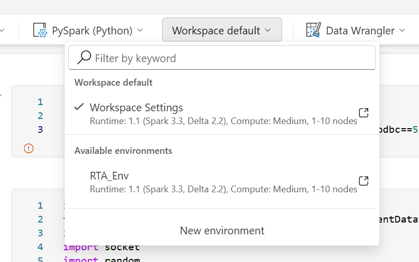
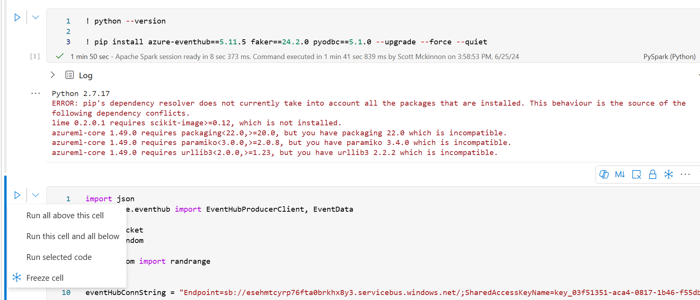

# Proctor Guide
## Real Time Intelligence Workshop

Fabric Real Time Intelligence (RTI) in a [Workshop](<https://aka.ms/fabricrtiworkshop>) covers how-to build a Medallion architecture design-pattern by using Real-Time Intelligence.

This asset can be proctor completely by using the [MOAW page](<https://aka.ms/fabricrtiworkshop>). See pre-req(s) to setup Fabric Trial Tenant.

Recommend setting up the tenant prior to the day of the event and completing the lab in the “LabAdmin” workspace as cheat-sheet for participants to leverage. Optionally, attendees may use their own Fabric environment, but it is required to enable Real-Time Dashboards (preview) feature to complete the lab (Section 8 – Building the platform).

If desired, on the day of the event the proctor may create a folder called “Workshop” inside the “LabAdmin” workspace to reproduce the lab live (Section 8 – Building the platform).

Alternatively, after completing the theoretical context, instruct the participants to complete the lab on their own, assist them, and help answer questions by having open discussions. 

If necessary, you can demo the Fabric Copilot that helps you write KQL queries here. 

MS-INTERNAL ONLY: To access "RTA Field Demos" workpace which is an F64 to demo Copilot from a KQL Queryset, join SG "adxdemoenv" on IDWeb via MSFT VPN. 

See [Introduction](<https://aka.ms/fabricrtiworkshop>) section for more info. Proctors may contact: fabricvbdtechleads[at]microsoft[dot]com or rtacat[at]microsoft[dot]com if you need help preparing for your delivery or have additional questions.

## The Delivery Guide

This asset can be proctor completely by using the [MOAW page](<https://aka.ms/fabricrtiworkshop>).

If desired, cover the introduction & theoretical context first, or simply skip ahead to Section 8 – Building the platform. The presentation is not required (can only be shared in PDF-format externally). However, the intro & theoretical context should take approximately 30-60 minutes. The purpose is not to read everything verbatim. Attendees will have access to review the MOAW in detail afterwards.

10m Break

Proceed to execute the Hands-On Lab (Section 8 - Building the platform). This should take approximately 1-2 hours. During which time allot for open discussion, questions-and-answers and breaks as necessary.

Conclude the workshop with "Section 9 - Continue your learning" or position a POC next.

Important Links - Readiness 
1. [Real-Time Intelligence Tutorial](<https://aka.ms/fabricrtiworkshop>)
2. [Real-Time Intelligence Tutorial - GitHub](<https://github.com/microsoft/FabricRTIWorkshop>)
3. [Building a Real-Time medallion architecture using Eventhouse in Microsoft Fabric](https://techcommunity.microsoft.com/t5/startups-at-microsoft/building-a-real-time-medallion-architecture-using-eventhouse-in/ba-p/4110686)
4. (MS internal-only) Evaluation form collaborator [link](https://forms.office.com/Pages/DesignPageV2.aspx?subpage=design&FormId=v4j5cvGGr0GRqy180BHbR0PMD-G9mq1Kry22u32eGOtUMjU2Q1BFR1BSUDJNSTJVUzBMWUdLTjVWVC4u&Token=dbbb3dba98ad45938c79397fd4dff25c) to edit & view responses. 
5. (MS internal-only) Recording of [RTI talking points](<https://microsoft.sharepoint.com/teams/PBICATs/Shared%20Documents/General/Recordings/View%20Only/General-20240508_110322-Meeting%20Recording.mp4?web=1&referrer=Teams.TEAMS-ELECTRON&referrerScenario=MeetingChicletGetLink.view.view>)
6. Public recordings available in "section 9 - Continue your learning" of the MOAW.

## Uploading the Real-time Dashboard from the JSON file

1. Download the [JSON](<https://github.com/microsoft/FabricRTIWorkshop/blob/main/dashboards/RTA%20dashboard/dashboard-RTA Dashboard.json>) file of the pre-built dashboard.
2. From the Real-Time Intelligence menu, select the Real-Time Dashboard option.
   

4. Name it "RTA Dashboard" and select **Create**.
   
5. From the Manage tab, select "Replace with file" option. Find the downloaded JSON file and select **Open**.
   

6. The Dashboard should repaint with the Adventure Works logo displayed, but the other dashboard titles showing error text.
7. From the Home tab, select **New data source**.

8. The Data Sources side bar will appear. There will be one source listed, select the pencil icon beside the "RTAdemo" title.

10. The Edit Data Sources side bar will appear. Confirm the "Data Source Name" and "Database" have "RTAdemo" selected. Then select **Apply**.

    
12. The dashboard will quickly repaint, and the visuals will appear. 

## Trouble Shooting

### The Notebook Doesnt Run

**Symptom** - The "Generate synthetic events" notebook doesnt run or just seems to hang once the **Run all** button has been selected.  

**Resolution** - Stand up a compute environment and run the notebook using that. 

**Steps**
From "8. Building the platform" > "Step 6. Run the notebook";

1. On the Notebook top menu, toggle the "Workspace default" drop box and select the **New Environment** option.

2. Enter a name for the environment and select **Create**.

3. This will present the environment configuration screen, which requires no change. Navigate back to the "Generate synthetic events" notebook.
   
4. The new environment will now appear in the "Workspace default" drop box, select it. This will attach the notebook to that environment and you will see a callout for **Updated environment** in the notification tab.

   
6. Click **Run all** at the top left to re-run the notebook.
   
7. Verify that the last code cell is printing out the generated synthetic events in JSON format.

   
### The Notebook Presents Package Errors

**Symptom** - The "Generate synthetic events" notebook runs, but doesnt progress past the first cell raising a number of python packaging errors.  

**Resolution** - Restart the process from the next cell.  

**Steps**
From "8. Building the platform" > "Step 6. Run the notebook";

1. Go to the second cell in the notebook and select the drop-down arrow beside the **Run Cell** button.
     
2. Select **Run this cell and all below** and the notebook should run as expected.

3. Verify that the last code cell is printing out the generated synthetic events in JSON format.
  
